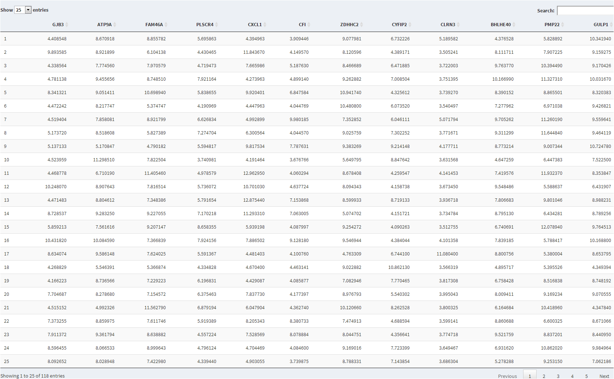

# DEFORM
## Data Exploration for Modeling

This repository contains code for an exploratory shiny dashboard for the 
exploration of datasets to be utilized in applied predictive modeling.  

Before you can start building a predictive model, you have to get a feeling for the 
data that is in front of you. How many samples you have,
the dimensionality of the data, how the different variables (features) are distributed,
whether they are skewed or if there are outliers in your data, that might be
problematic for models that are sensitive to it.

This dashboard gives a brief insight into all these potential problematic characteristics of an input dataset.

## Data Upload

In Machine Learning we tend to think in terms of feature matrices and label vectors. 
A feature matrix contains all samples in its rows and all features in its columns. 
The response (or labels) is a one dimensional vector that include the measurements 
to be predicted by the features contained in the feature matrix. Depending, whether 
this label vector is discrete or continuous, you are either faced with a classification 
or a regression problem. This application expects the feature matrix and the label vector 
to be uploaded two comma separate files. You should make sure that the feature matrix file 
includes a header, an that floating point numbers are formatted with a "." and not with a ",".
The label vector should be represented as a column vector with the same number of rows as the feature matrix.

## Dynamic Selectors

### Problem Type
Here you can define, whether you would like to few your data with regard to a regression (continuous label vector) or a classification (discreet label vector). Depending on your selection different visualization methods will be provided for you.

### Select Univariate Feature
Here you can select a single feature for which all univariate visualizations, like a QQ-Plot or a distribution histogram will be generated.

### Select Multivariate Features
Here you can select a number of features from the matrix that has been loaded, which will be included in the multivariate visualizations like feature correlation diagrams, skewness plots or dimensionality reduction techniques.

## Summary Statistics

This tab gives you an overview of the types of features (discrete or continuous) contained in the uploaded feature matrix. If the response vector is discrete the tab will also display the number of each label within the response, to give an indication about how the different classes are balanced over all samples. As strong dysbalances have to be considered in your cross-validation scheme, and the general prevalence of class prediction outcome. Additionally the distribution of each selected feature is displayed in a violin plot overlayed with a box plot, either over each class in the label vector, select in the "Label" option, or against another feature that can be continuous as well. Last but not least a basic summary statistics table is displayed, to give an overview over the number of observations, missing values, skewness, kurtosis and much more.

## Overview

The Overview tab gives a brief visual overview on how features are distributed in the feature matrix. The visualizations are divided in a univariate point of view, which includes a QQ-Plot and a dynamic histogram of the selected univariate feature and a multivariate view on the skewness of the selected multivariate features. As a rule of thumb for building an applied predictive model, skewness should be distributed within -2 and 2 for all features.

## Correlation

The Correlation tab includes two basic correlation visualizations. On the left side the selected multivariate features are plotted against each other in a Pairs plot. 

- The lower diagonal matrix shows a pairwise loess fit of each pair of features. 
- The upper diagonal matrix shows the Pearson correlation of each pair of features.
- The diagonal shows a histogram describing the respective feature distribution.

## Dimensionality Reduction

On the Dimension Reduction tab you have the option of applying different projection 
methods to lower the dimensionality of your data. Here you have the option between 
a Principal Component Analysis (PCA) and an Independent Component Analysis (ICA). The technique
will be applied to the data currently loaded feature matrix and in case of missing values, 
these will be imputed using a k-nearest neighbor approach. Because the PCA is a variance based projection method, the data will also be centered and scaled prior to application. As the ICA method is implemented in the fastICA it automatically does a PCA decomposition prior to finding the ICA scores, such that the data is centered and scaled as well.  
After you hit the Compute button you will be presented with a 3D and 3D projection of your data and in case of a PCA projection also with a screeplot indicating the cummulative variance still explained by the number of principal components after dimensionality reduction.

## PCA
Principle Component Analysis, or PCA is a technique that is widely used for applications such 
as dimensionality reduction, lossy data compression, feature extraction, and data visualization. There are two commonly used definitions of  PCA that give rise to the same algorithm. PCA can be defined as the orthogonal projection of the data onto a lower dimensional linear space, known as the principal subspace, such that the variance of the projected data is maximized. Equivalently, it can be defined as squared distance between the data points and their projections.

## ICA
Independent component analysis, or ICA is a computational method for separating a multivariate signal into additive subcomponents. This is done by assuming that the subcomponents are non-Gaussian signals and that they are statistically independent from each other. ICA is a special case of blind source separation. A common example application is the "cocktail party problem" of listening in on one person's speech in a noisy room.

## Author Information
Jens Hooge <[jens.hooge@gmail.com](mailto:jens.hooge@gmail.com)>

